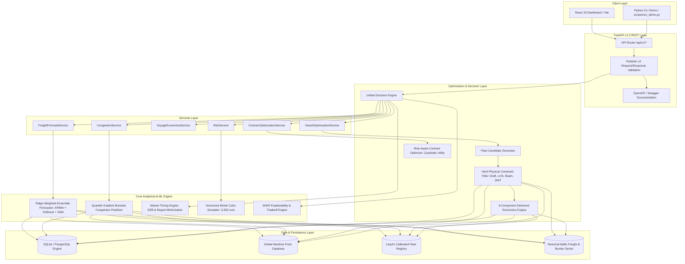
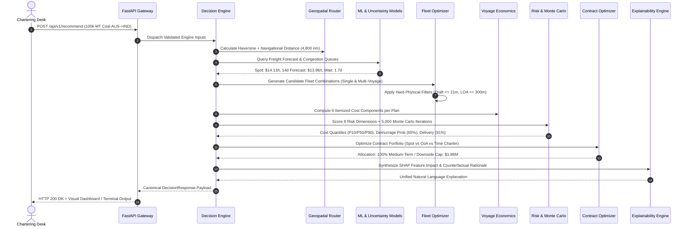

# CharterAI: Technical Architecture & System Design

**Version:** 2.0.0 (SIH Production Release)  
**Authors:** CharterAI Development Team  
**Runtime:** Python 3.14 (Backend/ML) & Node.js 18+ / React 19 (Frontend)

---

## 1. Architectural Overview

CharterAI is engineered as a modular, decoupled decision-support platform designed to process high-dimensional maritime market data, geospatial constraints, and econometric risks into actionable commercial chartering strategies.

### Architectural Principles:
1. **Separation of Concerns:** Strict isolation between Machine Learning, Optimization, Geospatial/Hydrodynamic calculation, and API Presentation layers.
2. **Deterministic Reproducibility:** Every stochastic module (Monte Carlo simulation, quantile regression sampling) incorporates seeded determinism (`seed=42`) ensuring bit-for-bit reproducible decisions under identical market inputs.
3. **Graceful Degradation:** The data layer supports dual-mode persistence (SQLite / SQLAlchemy database with automatic fallback to high-fidelity calibrated empirical registries).
4. **Strong Typing & Contract Safety:** All endpoints enforce Pydantic v2 schemas for bidirectional validation, rejecting malformed, negative, or physically impossible requests prior to computation.

---

## 2. System Architecture Diagram

---

## 3. Data Flow & Sequential Pipeline Execution

When a chartering desk submits a cargo inquiry, CharterAI executes an end-to-end 12-stage pipeline:

---

## 4. Component Layer Deep-Dive

### 4.1 FastAPI Gateway & Endpoint Taxonomy
* **`POST /api/v1/forecast/freight`**: Generates point and quantile multi-horizon forecasts.
* **`POST /api/v1/predict/congestion`**: Evaluates port dwell, berth occupancy, and delay probability.
* **`POST /api/v1/optimize/vessels`**: Filters vessels by physical berth compatibility.
* **`POST /api/v1/optimize/voyage`**: Ranks multi-voyage single and parcel fleet plans.
* **`POST /api/v1/optimize/contract`**: Optimizes contract risk portfolio using utility curves.
* **`POST /api/v1/analyze-voyage`**: High-speed complete voyage economics analysis.
* **`POST /api/v1/recommend`**: Master orchestrator running the full 12-stage pipeline.
* **`GET /api/v1/ports`**, **`GET /api/v1/vessels`**, **`GET /api/v1/routes`**, **`GET /api/v1/market`**, **`GET /api/v1/models`**: Metadata and catalog inspection endpoints.

### 4.2 Machine Learning Analytical Engine
* **Freight Forecaster Ensemble (`FreightForecastingModelV2`):** Combines ARIMA (stochastic trend), Quantile XGBoost (feature-driven non-linear shifts), and 30-day Exponential Moving Average via Ridge regression meta-learner.
* **Congestion Predictor (`PortCongestionPredictorV2`):** Predicts port queuing days using berth count, seasonal monsoon flags, vessel queue size, and terminal cargo handling rates.
* **Market Timing Engine (`MarketTimingEngine`):** Computes Expected Economic Benefit (EEB) against downside waiting risks:
  $$\text{EEB} = (\text{CurrentRate} - \text{ExpectedForecastRate}) \times \text{CargoQuantity} - \text{DemurragePenaltyRisk}$$

### 4.3 Hydrodynamics & Voyage Economics Engine
Computes 9 distinct cost components:
1. **Base Ocean Freight:** Spot or term rate $\times$ cargo tonnage.
2. **Bunker Fuel Expense:** Hydrodynamic fuel consumption ($F = k \cdot v^3 \cdot \Delta^{2/3}$) at sea + auxiliary consumption in port.
3. **Port Disbursements:** Pilotage, tuggage, berthage, mooring, and light dues.
4. **Waiting / Anchorage:** Idle fuel burn + daily charter hire during berth queuing.
5. **Demurrage Liability:** Contractual demurrage rate applied to days exceeding agreed laytime.
6. **Despatch Earned:** Credit earned if turnaround finishes faster than agreed laytime.
7. **Positioning & Ballast:** Ballast leg fuel expense for deadweight relocation.
8. **Canal Charges:** Fixed lockage and transit tolls (Suez/Panama where applicable).
9. **Miscellaneous & Agency:** Port agency, customs documentation, and sundries.

### 4.4 Risk & Probabilistic Engine
* **8 Risk Categories:** Market, Port Congestion, Weather, Vessel Availability, Operational, Geopolitical, Schedule, and Demurrage.
* **Vectorized Monte Carlo:** 5,000–10,000 stochastic trials perturbing freight rates, bunker prices, sailing speed, and port congestion to generate empirical Value-at-Risk (VaR) distributions.

---

## 5. Security & Production Hardening

* **Zero Information Leakage:** Production exception middleware intercepts internal traces, returning structured RFC 7807 problem details with unique request IDs (`req_*`).
* **Input Sanitization:** Enforces positive cargo tonnage, valid ISO-8601 laycan dates, and recognized UN/LOCODE port codes.
* **CORS & Middleware:** Configured for cross-origin integration with frontend dashboard while restricting unauthorized HTTP verbs.
